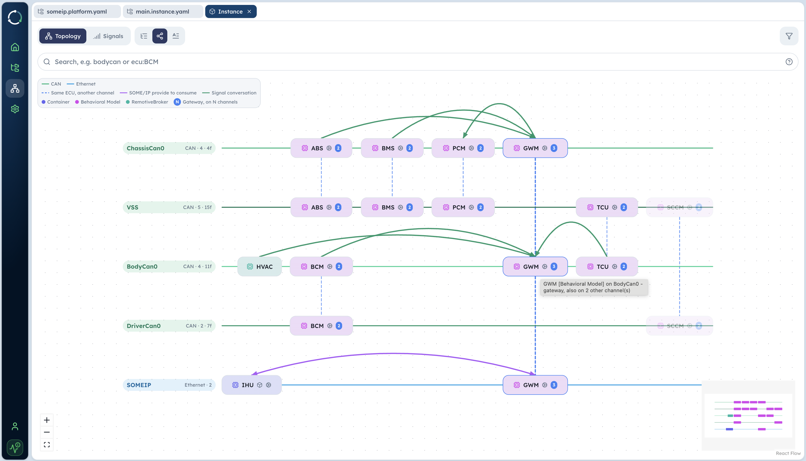
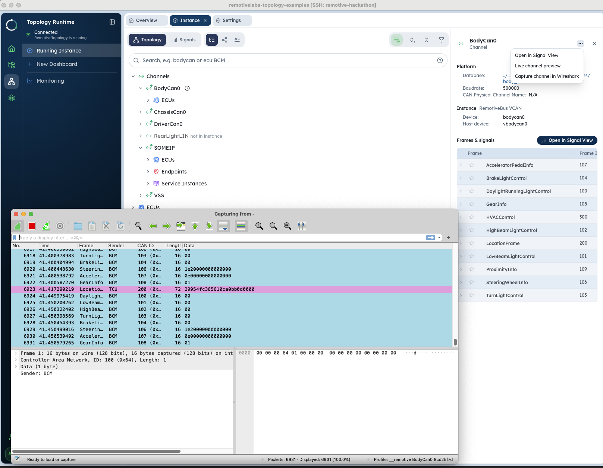

# RemotiveTopology lab — learn the platform by driving it with an agent

You have a virtual car on this box: nine ECUs, real CAN buses, an Android head unit, a 3D
visualisation, and a recorded Tesla drive playing back through all of it. This lab walks you
through starting it, watching it, and taking it apart — **by asking Kiro to do the work**, not by
memorising commands.

That is the point of the session. Kiro on this box already knows the car: which instance to run,
what the buses are called, where the models live. You bring the questions.

The lab comes in two halves, and only one of them is the destination.

**Part 1 — Understand the platform** is **optional**, and a menu rather than a checklist. Seven
exercises: start the car, watch it, take it apart, change it, break it. Each one stands alone, so take
the ones that look interesting and skip the rest. Budget ~90 minutes if you do them all.

**The one thing worth doing is Exercise 1: start the car.** Everything else depends on it, and you
need it running for Part 2 anyway. After that you can jump straight to Part 2 with a clear conscience.

**Part 2 — Go creative** is where the session is going. A feature to build, every design decision
yours, no steps to follow. Leave it the time it deserves.

**And beyond that** — inspiration only, nothing required. Is a driver actually in the seat? Are the
doors closed before the car is allowed to drive off? Add the sensor, decide which ECU owns the
interlock, and prove it on the bus. Keep pulling that thread and you are no longer extending our car,
you are designing your own E/E architecture: bring your own DBC, containerise your software, hang a
real ECU off the bus. [The contract is the database, not what stands behind it](#bring-your-own-ecu) —
and the CAN traffic here carries real messages.

## Before you start

- Setup done: you ran `source ~/aws-hackathon/participant/setup-day2.sh` and it printed all `[ok]`
  (see `INSTRUCTIONS.md` step 4).
- Your SSH tunnels are up (`ssh remotive-hackathon`). Every URL below is `localhost` **on your own
  machine** — nothing on this box is reachable any other way.
- Kiro is connected over Remote-SSH with `~/remotivelabs-topology-examples` open as the folder.
  Type your prompts there.

One ground rule for exercises 1 to 5: **they do not change the examples repo.** You run it, read it
and visualise it. Anything you want to keep goes in the `dashboards/` folder at the repo root — that
is a symlink to `~/aws-hackathon/participant/dashboards`, so your work is kept with the hackathon
folder even though Studio insists on saving inside its own workspace. Exercises 6 and 7 do edit the
repo, always with a revert next to the change; `git status` there is your safety net.

## What you are looking at



That is your car, drawn by RemotiveStudio from the instance file you are about to run — not a diagram
someone maintained by hand. Once Studio is up in 1.3 this link opens exactly the picture above:
[**the running instance, as a graph**](http://localhost:57123/files?path=%2Fremotive_car%2Finstances%2Fandroid%2Fmain.instance.yaml&viewMode=instance&view=topology&topologySubView=graph).

The same instance is also worth seeing
[**as a tree**](http://localhost:57123/files?path=%2Fremotive_car%2Finstances%2Fandroid%2Fmain.instance.yaml&viewMode=instance&view=topology&topologySubView=tree)
and
[**as resolved YAML**](http://localhost:57123/files?path=%2Fremotive_car%2Finstances%2Fandroid%2Fmain.instance.yaml&viewMode=instance&view=topology&topologySubView=yaml)
— that last one is every `includes:` already followed, the same content `remotive topology show
instance` prints in exercise 4. Those three are the buttons in the toolbar; the links just skip the
clicking.

Read it as five **buses**, one per row, with the ECUs sitting on each:

| Row | Who is on it |
|---|---|
| `ChassisCan0` | ABS, BMS, PCM → GWM |
| `VSS` | ABS, BMS, PCM, TCU, SCCM — the recorded drive's own channel, not a vehicle bus |
| `BodyCan0` | HVAC, BCM, GWM, TCU |
| `DriverCan0` | BCM, SCCM |
| `SOMEIP` | IHU ↔ GWM (Ethernet) |

Four details in that picture are worth having before you start:

- **Colour is the kind of ECU.** Magenta is a *behavioral model* (Python logic), green is a bare
  *RemotiveBroker* with no behaviour, blue is a *container* standing in for an ECU. So `HVAC` being
  green and everything else magenta is not a rendering quirk — it is the one ECU here with no logic
  behind it, and so a genuine blank slate if you want one. `IHU` carries the container icon because it
  is a full Android build.
- **The same ECU appears on several rows.** `GWM` is on `ChassisCan0`, `BodyCan0` and `SOMEIP`; the
  `3` badge says so and the dashed lines join them up. That is what makes it a gateway, and it is why
  the recording can reach an Android head unit at all.
- **The green arcs are signal conversations** — who actually talks to whom, derived from the
  databases. The purple one is SOME/IP, provider to consumer.
- **What is missing.** No `DIM` row entry anywhere, though the chassis database lists it as a real
  ECU on that bus — an instrument cluster nobody has implemented. Exercise 4.2 walks you into it.

Underneath the drawing: each ECU is its own RemotiveBroker container, and most of them also run a
small Python *behavioral model* that implements the logic. The recorded drive is played in by a
`playback` container, which feeds the `VSS` row; the five ECUs on that row are what turn recorded
signals into real CAN traffic on the rows above.

The **topology broker** is the one that sees every bus at once — that is what Studio, the 3D car
and any test connect to. Each ECU also has its own broker that sees only its own buses, which is
what makes the simulation behave like a real car rather than one shared database.

The buses are the real thing on the protocol level, not messaging between containers. CAN and LIN
run over SocketCAN interfaces you can `candump`; Ethernet runs over real interfaces, with the VLAN,
MAC and IP addresses the platform files declare, and every SOME/IP message comes from the endpoint
that actually provides that service. That accuracy is the point: real hardware can be plugged onto
any of these buses and fit in unchanged.

---

# Part 1 — Understand the platform

**Optional, and pick as you please.** Seven exercises against the one running car, each standing on
its own. The aim is not to finish them but to come out able to answer, without guessing: what is on
this bus, who put it there, which file decided that, and how would I prove it. Part 2 goes faster once
those have stopped being mysterious — but it does not require any of this, so skip freely.

**Exercise 1 is the exception: do that one.** It starts the car, and Part 2 needs a running car.

If you are short on time, a good subset is 1 (start it), 3 (four ways to watch the same traffic) and 6
(change the car at three depths) — start, observe, modify.

Each exercise tells you what to do. That changes in Part 2.

---

## Exercise 1 — Start the car and watch it drive (~15 min)

**Goal:** the car running, and you able to look at it four ways — as a moving vehicle, as a head
unit, as raw CAN traffic, and as a platform in RemotiveStudio.

### 1.1 Ask Kiro to start it

In Kiro:

> Start the RemotiveCar topology with the Android head unit and the 3D car. Check whether it is
> already running first.

Kiro knows the instance to build (`instances/android/main.instance.yaml` +
`cuttlefish.instance.yaml`) and the profiles to enable (`playback`, `3dcar`). Two things worth
knowing while it works:

- **First start is slow.** The Cuttlefish Android image is ~7 GB, so the initial pull takes a
  while. After that, `remotive topology build` takes a couple of seconds and starting is quick.
- **Android takes 1–2 minutes to boot.** Watch for this line in the console, which is the moment
  the head unit is usable:
  ```
  ihu-1  | Cuttlefish is started and ready to use
  ```
  The `ihu` service also flips to `healthy` around then.
- It may already be up — the box is often left running. Then Kiro should tell you so instead of
  restarting it, and you can go straight to 1.2.

> **Attached or detached — know which you got.** Kiro starts the car **detached** (`up -d`), so no
> terminal owns it and you watch it with `docker compose ... logs -f ihu` instead. If you run
> `docker compose ... up` yourself, that terminal streams every container's log — nice for spotting
> the Cuttlefish line — but it also **owns the car**, so `Ctrl+C` there stops all 20 containers. In
> that case leave it alone and use a second terminal for everything else (`candump`, the CLI, Studio).
> A car that is already detached cannot be adopted by a foreground `up` afterwards; it is one or the
> other from the start.

### 1.2 Watch it drive — three ways

Open these on your own machine (the tunnels are already forwarding them):

| Where | URL | What you should see |
|---|---|---|
| 3D car | http://localhost:3000 | A car driving: speed, steering and indicators following the recording. Press **`c`** to cycle through the camera views — outside, cockpit, dashboard. |
| Android head unit | https://localhost:8443 | The Cuttlefish screen (accept the self-signed cert). Open **Organic Maps** from the app launcher and you can follow the route the recording is driving. |
| Raw CAN | in your **second** terminal: `candump vchassiscan0` | Live CAN frames on the chassis bus |

The `candump` one is worth pausing on. This is not a simulation of CAN in a database somewhere —
RemotiveBus gives the box real SocketCAN interfaces (`vdrivercan0`, `vbodycan0`, `vchassiscan0`),
so ordinary Linux CAN tooling works unchanged. Stop it with `Ctrl+C`.

Raw bytes are the wrong tool for a single value, though. For that, ask the broker instead:

```bash
remotive broker signals subscribe --signal topology-ChassisCan0:UISpeedFrame.uispeed
```

Same traffic, decoded: signal name and physical value instead of `07B [8] 5F 07 ...`. Exercise 3
goes into when to reach for which.

### 1.3 Open RemotiveStudio

The 3D car and the Android screen show you the *result*. Studio is where you look at the car
itself — the buses, the databases, the live signals. Start it on the box, in your **second**
terminal — not the one the car is running in:

```bash
remotive studio ~/remotivelabs-topology-examples --no-browser
```

Studio also holds its terminal while it serves. If you want a shell back for `candump` and the CLI,
open a third one — cheap, and it saves you from stopping something by reflex.

Then open http://localhost:57123 on your machine. Pointing it at the examples repo matters: the
**Files** sidebar becomes the car's source (platform, instances, databases), and Studio picks up the
running topology broker by itself — Settings → Connections should already read `localhost:50051`.

Have a look around, no dashboard yet: that is exercise 2. Two things worth clicking now:

- **Files → [`remotive_car/platform/remotive-car.platform.yaml`](http://localhost:57123/files?path=%2Fremotive_car%2Fplatform%2Fremotive-car.platform.yaml&viewMode=platform&view=topology&topologySubView=graph)** —
  the whole vehicle rendered as a graph of channels and ECUs.
- the **signal view** (bar-chart icon in the viewer's toolbar) — a searchable table of every frame
  and signal in the databases. Search `speed`.

> **File links in this lab open in Studio.** From here on, every file path that names a real file in
> the repo is a link — clicking it opens that file in Studio, in the view that suits it. They only
> work while Studio is running (from 1.3 onwards) and with your tunnel up; if one does nothing, that
> is why, and the path in the link text is still what you want in the editor.
>
> The pattern is worth knowing, because you can build one for any file:
>
> ```
> http://localhost:57123/files?path=<url-encoded path>&viewMode=<mode>&view=topology&topologySubView=graph
> ```
>
> | Parameter | Values |
> |---|---|
> | `path` | the file, URL-encoded from the repo root (`%2F` for each `/`) |
> | `viewMode` | which viewer: `instance`, `platform` (also for `*.dbc`/`*.ldf`), `text`, `dashboard` |
> | `view` | `topology` or `signals` |
> | `topologySubView` | `graph`, `tree` or `yaml` — **`tree` if you leave it out**, so name `graph` when you want the picture |
> | `entityId` | jump straight to one thing: `ecu:GWM`, `channel:ChassisCan0` |
>
> Those map onto the controls in the UI, and it is worth not confusing the two of them:
>
> - the **⋮** menu → **View Mode** picks the *viewer* — for a `.dbc`, **Text** or **Platform**; for an
>   instance file, **Text** or **Instance**. That is `viewMode`.
> - inside the graph viewer, a toolbar with **Topology** / **Signals** tabs and three layout buttons,
>   **As tree** / **As graph** / **As YAML**. Those are `view` and `topologySubView`.
>
> A link is only ever a shortcut to somewhere you can reach by hand. Which one a question needs: the
> graph and tree show *structure* and deliberately omit values — addresses, ports, cycle times and
> factors live in the text.
>
> **Source files link into the editor instead.** Model code (`abs.py`, `turn_signals.py`, the mapping
> and recording-session files) has nothing to render in Studio, so those links open the file in Kiro
> where you can actually edit it. Two kinds of link, then: platform and instance files go to Studio to
> be *looked at*, source files go to the editor to be *changed*. Exercises 6 and 7 are all the second
> kind.



That is the same Studio running as a **desktop app on your own machine**, handing `BodyCan0` to
Wireshark decoded — `TurnLightControl`, `GearInfo` and `LocationFrame` by name, `BCM` and `TCU` as
senders, instead of anonymous bytes. The browser cannot do that. If you want it, see
[*Optional: Studio on your own machine*](#optional-studio-on-your-own-machine) at the end — but
finish the lab first, nothing here depends on it.

### 1.4 See how many moving parts there are

> Show me what containers are running and explain what each group is.

You should see about **20 containers**: one `<ECU>-broker.com` per ECU, a small model container per
ECU that has behaviour (`bcm`, `gwm`, `abs`, `bms`, `pcm`, `sccm`, `tcu`), the `playback` container
feeding the recording in, `3d-car`, `ihu` (that is Cuttlefish), plus `topology-broker.com` and
`topology-api` for the outside world.

```
SERVICE               STATUS
3d-car                Up 2 minutes
ABS-broker.com        Up 2 minutes (healthy)
...
ihu                   Up 2 minutes (healthy)
playback              Up 2 minutes
topology-broker.com   Up 2 minutes (healthy)
```

Now the more interesting question: **why those and not others?** Nothing scanned your machine and
decided. Every one of those containers is there because it is declared in an **instance file** —
open `remotive_car/instances/android/main.instance.yaml` and follow its `includes:`. Each entry
either names a model to run, a mock to fake an ECU, or a plain broker with no behaviour at all:

```yaml
ecus:
  HVAC: {}          # broker only — no behaviour, its frames sit at restbus defaults
  BCM:
    models:         # a container running models/bcm
      bcm: ...
  SCCM:
    mock: {}        # an ECUMock: cyclically sends every frame SCCM is sender of, no logic
```

That is the division of labour worth remembering:

- the **DBC** decides which frames exist, who sends them and how often — the *car*;
- the **instance file** decides which of those ECUs actually run here and with how much intelligence
  — the *test setup*.

Same platform, different instance files: swap models for mocks, drop the head unit, add a test
runner. `instances/hello_world/main.instance.yaml` is the same car with no Android and a Jupyter
notebook instead.

> Ask Kiro: *Which instance files produced this set of containers, and which ECUs are models, mocks
> or plain brokers?*

### Think about it

Two questions to sit with before the next exercise. Try answering yourself first, then ask Kiro
and compare.

1. Nothing here is a real ECU, yet the buses carry real CAN frames. What is generating them, and
   what decides which frames each ECU sends — and how often?
   > Ask Kiro: *Which file decides that ABS transmits `UISpeedFrame` every 200 ms, and how do I
   > confirm that rate on the running car?*

   Note where the answer comes from: **who sends what** is in the platform and database files, while
   **what is actually happening** comes from the live tools. Different questions, different tools.
2. `ihu` is a full Android build. How does it get vehicle data — does it read CAN?
   > Ask Kiro: *How does the Android head unit receive vehicle signals in this setup?*

> Something not behaving? [`TROUBLESHOOTING.md`](TROUBLESHOOTING.md) — or just ask Kiro, it can
> look at the containers and logs for you.

---

## Exercise 2 — Build a dashboard (~15 min)

**Goal:** one screen where the camera from the recorded drive, a continuous signal and a blinking
signal share the same timeline — and it still exists tomorrow. Then drive the whole car from its
seekbar.

You are in Studio from 1.3, with the car running.

### 2.1 A new dashboard

Left sidebar **Topology Runtime** → **New Dashboard**. You get an empty canvas as a tab.

It is a **draft** until you save it. Nothing is written to disk before you use `Save As`, so do that
early (2.6) if you would rather not lose the layout.

### 2.2 A camera from the drive

**Add Panel** → **Video** → pick `front`.

Where does video come from in a *live* topology? From the same place the signals do: the recording
being played back. [`remotive_car/recordings/tesla.recordingsession.yaml`](../../remotivelabs-topology-examples/remotive_car/recordings/tesla.recordingsession.yaml) lists one VSS CSV and four
mp4s, named `front`, `rear`, `left`, `right` — Studio offers exactly those names. (`rear` is
`back.mp4`; the name in the session file is what counts, not the filename.)

### 2.3 Speed and the left indicator on one chart

**Add Panel** → **Time series**, then add two signals:

| Namespace | Signal |
|---|---|
| `topology-ChassisCan0` | `UISpeedFrame.uispeed` |
| `topology-BodyCan0` | `TurnLightControl.LeftTurnLightRequest` |

Note what you just did: **two different CAN buses in one chart.** That works because both namespaces
are `topology-*` — the topology broker's bus-wide view. An ECU's own broker only offers its own
buses (`BCM-BodyCan0`, `ABS-ChassisCan0`), which is the point: the ECUs see a car, you see
everything.

Watch the two shapes. Speed is a smooth line in m/s, arriving 5 times a second. The indicator is
`0`/`1`, flat for long stretches, then a square wave: **1 s on, 1 s off** while the recording
signals a turn. Nobody sends "blink" on the bus — BCM toggles that signal, and the 3D car's front,
rear and dashboard lamps all follow the same one.

Worth adding a third signal to make it a story: `topology-DriverCan0` / `TurnStalk.TurnSignal`. That
is the *driver's* stalk from the recording, and the chart shows BCM reacting to it about 25 ms later.
Input on one bus, decision on another.

### 2.4 Drag the seekbar

Now that you have a video and a chart on one canvas, use the **playback seekbar** at the top of the
dashboard. Drag it somewhere else in the drive.

Everything moves together: the camera jumps, the speed trace redraws, the indicator square wave
lands in a different place — and if you have the Android head unit open, its speedometer follows
too. You are not scrubbing the dashboard, you are scrubbing **the car**. The recording sits upstream
of five ECUs (ABS, BMS, PCM, SCCM, TCU); move it and each of them re-derives its own signals, so all
three CAN buses and the SOME/IP link change at once.

The same control is on the CLI, offsets in microseconds — the drive is 60 s long and repeats:

```bash
remotive broker playback status /tesla.recordingsession.yaml
remotive broker playback seek --offset 3000000 /tesla.recordingsession.yaml
remotive broker playback pause /tesla.recordingsession.yaml
remotive broker playback play  /tesla.recordingsession.yaml
```

**Then pause it and watch for four seconds.** This is the interesting one. Add
`BatteryStatus.StateOfCharge` and `MotorInfo.MotorSpeed` from `topology-ChassisCan0` to your chart
first, then pause. Three ECUs on the same bus, losing the same input, behave in three different ways:

| Signal | Owner | On pause |
|---|---|---|
| `BatteryStatus.StateOfCharge` | BMS | jumps to `1023` — the 10-bit **SNA** ("not available") |
| `MotorInfo.MotorSpeed` | PCM | jumps to `65535` — SNA |
| `UISpeedFrame.uispeed` | ABS | **freezes** at the last real speed |

None of the frames stop. All four keep arriving on cycle the whole time. BMS and PCM have a watchdog
that writes the DBC's reserved SNA value when input goes missing (`SNA_ON_MISSING_INPUT_TIMEOUT=3`
in the instance file); ABS has no such fallback, so it keeps transmitting a speed that is no longer
true. Press play and everything recovers.

That gap is the entire subject of exercise 7, and you just produced it with a slider. Keep it in
mind: *frame present* and *value meaningful* are two different questions.

### 2.5 Optional: how busy is the bus

**Add Panel** → **Frame distribution**. It lists the frames arriving, ordered by frequency. One per
dashboard. Exercise 3 comes back to this next to `candump`.

### 2.6 Save it where it survives

**Save As** → into the **`dashboards/`** folder → give it a name, e.g. `drive`.

Studio can only save inside its own workspace, which is the examples repo. `dashboards/` there is a
symlink to `~/aws-hackathon/participant/dashboards`, so saving into it keeps your work with the
hackathon folder and out of the examples checkout. The file is `drive.dashboard.json` — plain JSON,
worth opening in the editor to see how a panel is described.

### Think about it

> Ask Kiro: *The indicator toggles once a second. Who decides that, and what would I change to make
> it blink faster?*

A worked version with all of this — two cameras, the chart and a frame-distribution panel — is in
`~/aws-hackathon/participant/dashboards/drive.dashboard.json` if you want to compare or catch up.

> Panels empty, no videos offered, chart flat? [`TROUBLESHOOTING.md`](TROUBLESHOOTING.md) →
> *RemotiveStudio and dashboards*.

---

## Exercise 3 — Four views of the same traffic (~15 min)

**Goal:** stop reaching for one tool by habit. The same drive can be watched as bytes, as decoded
values, as frame rates, and as Ethernet packets — and each answers a different question.

Everything here runs in your second terminal, with the car still up.

### 3.1 Bytes on the wire — `candump`

```bash
candump vchassiscan0
```

Four frame IDs go past. They are the whole chassis bus:

| ID | Frame | Sender | Cycle | Carries |
|---|---|---|---|---|
| `07B` (123) | `UISpeedFrame` | ABS | 200 ms | `uispeed`, m/s |
| `08C` (140) | `BatteryMeasurement` | BMS | 20 ms | pack voltage, current |
| `08D` (141) | `BatteryStatus` | BMS | 100 ms | state of charge, power |
| `096` (150) | `MotorInfo` | PCM | 20 ms | motor speed, torque |

Filter to one of them with a mask — `candump` takes `interface,id:mask`:

```bash
candump vchassiscan0,07B:7FF
```

```
  vchassiscan0  07B   [8]  41 04 00 00 00 00 00 00
```

`0x0441` = 1089, and the DBC's factor for `uispeed` is 0.01, so 10.89 m/s. Doing that by hand is the
point of this step: bytes are the right view when you care about *what is physically on the bus*, and
the wrong one for reading a value.

Two things to know. `candump any` shows every frame several times — each container gets its own
`vxcan` peer for the buses it is on, and `any` catches both ends, so name the interface. And if one of
the four IDs is missing, that is worth chasing rather than shrugging at: a frame disappears when the
model that owns it has died. `docker ps -a` shows an `Exited` container, and `up -d <service>` brings
it back. Exercise 7 is about exactly that situation.

### 3.2 Decoded signals — the broker

```bash
remotive broker signals subscribe --signal topology-ChassisCan0:UISpeedFrame.uispeed
```

```
{"namespace": "topology-ChassisCan0", "name": "UISpeedFrame.uispeed", "value": 8.16}
{"namespace": "topology-ChassisCan0", "name": "UISpeedFrame.uispeed", "value": 8.31}
```

Names and physical values, because the broker holds the same databases the ECUs do. `--signal` is
repeatable and takes `NAMESPACE:Frame.Signal`, so you can put two buses side by side in one stream:

```bash
remotive broker signals subscribe \
  --signal topology-DriverCan0:TurnStalk.TurnSignal \
  --signal topology-BodyCan0:TurnLightControl.LeftTurnLightRequest \
  --on-change-only
```

`--on-change-only` drops cyclic repeats; `--x-plot` draws a rough chart in the terminal.

Worth noticing: a signal subscription is **change-driven**. If a value stops changing, this command
goes quiet even though the frame is still being transmitted every 200 ms. That difference between
"quiet signal" and "absent frame" is the whole subject of exercise 7.

### 3.3 How busy is the bus — `frame-distribution`

```bash
remotive broker signals frame-distribution --namespace topology-ChassisCan0
```

```
{'frameId': 123, 'count': '5'}
{'frameId': 140, 'count': '50'}
{'frameId': 141, 'count': '10'}
{'frameId': 150, 'count': '51'}
```

Counts per second. Read them against the table in 3.1: 5/s is the 200 ms cycle, 50/s is 20 ms, 10/s
is 100 ms. Those rates are not in any model's code — they come from `GenMsgCycleTime` in the DBC, and
the broker's restbus honours them. Exercise 4 goes to that line; exercise 6 changes it.

### 3.4 The Ethernet side — SOME/IP packets

CAN is not the only bus. The head unit is fed over Ethernet, and that traffic is just as real:

```bash
sudo tcpdump -i any -n udp port 16000
```

```
172.31.0.18.16000 > 172.31.0.12.43226: UDP, length 20
172.31.0.18.16000 > 172.31.0.12.43226: UDP, length 20
```

`172.31.0.18` is GWM, `172.31.0.12` is the Android head unit, and `16000` is the UDP port — none of
those are defaults or accidents. All three are declared in
[`remotive_car/platform/someip.platform.yaml`](http://localhost:57123/files?path=%2Fremotive_car%2Fplatform%2Fsomeip.platform.yaml&viewMode=text),
under the `host_gwm` and `host_ihu` endpoints. Open it next to the capture and the header of every
packet above is accounted for.

> **You need the text to see these values.** A platform file opens as a *graph*, which shows the shape
> of the network but none of its numbers — no addresses, no port, no VLAN. Two ways to the text, and
> both are worth knowing: the **As YAML** button in the graph's toolbar, or the **⋮** menu →
> **View Mode** → **Text**. The link above lands on the latter. Graph and text answer different
> questions and exercise 4 uses both.

Add `-x` and you can read the body by hand:

```
0066 03ea 0000 000c 0000 0000 0100 0200 4113 3333
└──┬─┘ └─┬┘ └───┬──┘ └───┬───┘  │ │ │ │  └───┬───┘
 102   1002   length   client/   1 0 2 0    9.20
Speed  Speed          session      │
Service Event                  NOTIFICATION
```

Service 102 / event 1002 is `SpeedService.SpeedEvent`, the payload is a big-endian FLOAT32, and
16 bytes of header + 4 of payload = the 20-byte packets. Every one of those facts comes out of
[`remotive_car/platform/databases/someip.fibex.xml`](http://localhost:57123/files?path=%2Fremotive_car%2Fplatform%2Fdatabases%2Fsomeip.fibex.xml&viewMode=text) —
the service id, the event id, the parameter's type and its byte order are all declared there, the way
frame layout is declared in a DBC. Same again: it is the raw view that shows them, so search that file
for `SpeedEvent` rather than scrolling. The other sizes in the same capture are the siblings: 28 bytes is
`LocationEvent` (three doubles' worth of position and heading), 18 bytes is `TurnlightControlEvent`
(`01 00` — left indicator on).

So the two halves of the Ethernet side live in two files, and it is worth keeping them apart:
`someip.platform.yaml` says **where** (addresses, port, VLAN, who provides and consumes),
`someip.fibex.xml` says **what** (services, events, parameter types). Exercise 4.3 comes back to
that split.

This is what the introduction means by protocol-accurate. Nothing here is a container messaging
another container: it is SOME/IP over UDP, from the endpoint that provides the service, on the VLAN
the platform declares.

> Prefer this decoded? That is what the Studio **desktop** app's *Capture channel in Wireshark* does
> for CAN, with frame and sender names filled in — see the last section.

### Which tool for which question

| Question | Tool |
|---|---|
| What is physically on the bus | `candump <iface>` / `tcpdump` |
| What is this signal's value right now | `remotive broker signals subscribe` |
| How often is this frame really sent | `remotive broker signals frame-distribution` |
| What does it look like over time, or all at once | Studio dashboards, the 3D car |
| Who *should* send it, and how often | the platform and database files — exercise 4 |

### Think about it

The recording delivers `Vehicle.Speed` about 10 times a second, but `UISpeedFrame` goes out exactly
5 times a second, always.

> Ask Kiro: *Why doesn't the CAN frame rate follow the rate of the recorded signal?*

---

## Exercise 4 — Read the platform (~10 min)

**Goal:** be able to answer "who sends this, to whom, on which bus, how often" without looking at
any running traffic — and know which file to trust for each part of the answer.

### 4.1 The resolved instance

Instance files include other instance files, so no single file shows you the car. Ask the CLI to
resolve them:

```bash
remotive topology show instance remotive_car/instances/android/main.instance.yaml
```

Studio does the same job visually — open
[`instances/android/main.instance.yaml`](http://localhost:57123/files?path=%2Fremotive_car%2Finstances%2Fandroid%2Fmain.instance.yaml&viewMode=instance&view=topology&topologySubView=graph)
and you get the resolved instance as a graph, with the `includes:` already followed. The
[**As YAML**](http://localhost:57123/files?path=%2Fremotive_car%2Finstances%2Fandroid%2Fmain.instance.yaml&viewMode=instance&view=topology&topologySubView=yaml)
button next to it prints what the command above prints — same resolution, two presentations.

One caveat that applies to both: **the resolution is only as complete as the files you name.** The car
you are running was built from *two* `-f` files, and the second one
([`cuttlefish.instance.yaml`](http://localhost:57123/files?path=%2Fremotive_car%2Finstances%2Fandroid%2Fcuttlefish.instance.yaml&viewMode=instance&view=topology&topologySubView=graph))
replaces IHU's Python model with the Android container. Resolve `main.instance.yaml` on its own and
IHU still looks like a Python model — honest about the file, wrong about your car.

The channels come out with the host devices you used in exercise 3:

```yaml
channels:
  ChassisCan0:
    type: can
    driver:
      type: remotivebus
      config: { type: vcan, device: chassiscan0, host_device: vchassiscan0 }
  SOMEIP:
    type: ethernet
    driver: { type: remotivebus, device: someip, host_bridge_device: corenetwork }
    gateway_ip: 172.31.0.253
    topology_broker_ip: 172.31.0.254
```

That is where `candump vchassiscan0` comes from. Further down, every ECU with the buses it sits on
and what runs for it:

```yaml
ecus:
  ABS:
    channels: { ChassisCan0:, VSS: }
    models:
      abs: { command: python -m playback.local.abs }
```

### 4.2 The database is the car

Open [`remotive_car/platform/databases/chassis_can.dbc`](http://localhost:57123/files?path=%2Fremotive_car%2Fplatform%2Fdatabases%2Fchassis_can.dbc&viewMode=text).

A DBC opens as a **graph**, which is the wrong view for this step — it draws the bus but hides the
syntax. For the raw DBC, click the **⋮** (three vertical dots) and pick **View Mode** → **Text**; the
two options there for a database are **Text** and **Platform**. The link above lands on `Text` already.
Find the menu once anyway, because 4.4 wants `Platform` back and the same menu does it.

Note that **As YAML** in the graph's toolbar is *not* the same thing: that renders the database as
Studio's own YAML, whereas `View Mode → Text` gives you the DBC as written. For this step — reading DBC
syntax — you want `Text`.

Four lines answer most questions:

```
BU_: ABS BMS PCM GWM DIM

BO_ 123 UISpeedFrame: 8   ABS
 SG_ uispeed : 0|16@1+ (0.01,0) [0|250] "m/s" GWM

BA_ "GenMsgCycleTime" BO_ 123 200;
```

Sender after the frame name, receivers after the signal's unit, factor in the parentheses, cycle time
in the attribute at the bottom. This is the file that decides ABS transmits `UISpeedFrame` every
200 ms — and, because membership is derived from it, the file that decides ABS is on this bus at all.

`remotive topology show signals remotive_car/platform/databases/chassis_can.dbc` prints the same
thing as YAML if you prefer it that way.

Now look at `BU_` again. **DIM** is there, and it is listed as a receiver of the battery and motor
signals — but there is no DIM container in your `docker ps`. That gap is the division of labour worth
carrying home: the database describes the *car*, the instance file describes *what is running today*.
DIM is a real ECU on this bus that nobody has implemented yet — raw material if you want a second thing
to build after Part 2.

### 4.3 The Ethernet half

Two files, and they split differently from CAN:

- [`remotive_car/platform/someip.platform.yaml`](http://localhost:57123/files?path=%2Fremotive_car%2Fplatform%2Fsomeip.platform.yaml&viewMode=platform&view=topology&topologySubView=graph)
  — the network. Subnet `172.31.0.0/24`, VLAN 123, endpoints `host_gwm` (172.31.0.18) and `host_ihu`
  (172.31.0.12), UDP port 16000, and per endpoint which services it **provides** and which it
  **consumes**.
- [`remotive_car/platform/databases/someip.fibex.xml`](http://localhost:57123/files?path=%2Fremotive_car%2Fplatform%2Fdatabases%2Fsomeip.fibex.xml)
  — the services themselves: `SpeedService` is service 102, its `SpeedEvent` is method 1002, its
  `Speed` parameter is a FLOAT32, high-low byte order.

Between them they explain every field of the packet you decoded in 3.4. Note that GWM provides four
services and consumes one: the head unit is not a passive display, it publishes `HVACService` back.

### 4.4 The same thing, drawn

[**`remotive_car/platform/remotive-car.platform.yaml`, as a graph**](http://localhost:57123/files?path=%2Fremotive_car%2Fplatform%2Fremotive-car.platform.yaml&viewMode=platform&view=topology&topologySubView=graph)
renders the platform the way the intro's picture rendered the instance, and each channel's menu opens
the frame and signal table. Same data as the files, laid out for a different question — good for "what
is near this ECU", less good for "what exactly does this line say".

You can also land on a single thing with `entityId`, which is handy once the graph gets busy:
[`ecu:GWM`](http://localhost:57123/files?path=%2Fremotive_car%2Fplatform%2Fremotive-car.platform.yaml&viewMode=platform&view=topology&topologySubView=graph&entityId=ecu%3AGWM)
or
[`channel:ChassisCan0`](http://localhost:57123/files?path=%2Fremotive_car%2Fplatform%2Fremotive-car.platform.yaml&viewMode=platform&view=topology&topologySubView=graph&entityId=channel%3AChassisCan0).

Worth noticing what that file does **not** contain: any list of ECUs. It declares channels and points
at databases, nothing more. Every ECU you see in the graph was derived from the DBCs by reading who
sends and who receives — which is the same rule from 4.2, now drawn for you.

### What each file is authoritative for

Every file below is a link into Studio — this table doubles as the index for the rest of the lab.

| For | Look at |
|---|---|
| Which frames exist, senders, receivers, layout, cycle time | [`chassis_can.dbc`](http://localhost:57123/files?path=%2Fremotive_car%2Fplatform%2Fdatabases%2Fchassis_can.dbc&viewMode=text) · [`body_can.dbc`](http://localhost:57123/files?path=%2Fremotive_car%2Fplatform%2Fdatabases%2Fbody_can.dbc&viewMode=text) · [`driver_can.dbc`](http://localhost:57123/files?path=%2Fremotive_car%2Fplatform%2Fdatabases%2Fdriver_can.dbc&viewMode=text) · [`rearlight.ldf`](http://localhost:57123/files?path=%2Fremotive_car%2Fplatform%2Fdatabases%2Frearlight.ldf&viewMode=text) |
| Which SOME/IP services and events exist | [`someip.fibex.xml`](http://localhost:57123/files?path=%2Fremotive_car%2Fplatform%2Fdatabases%2Fsomeip.fibex.xml) |
| Addresses, VLANs, ports, who provides/consumes | [`someip.platform.yaml`](http://localhost:57123/files?path=%2Fremotive_car%2Fplatform%2Fsomeip.platform.yaml&viewMode=platform&view=topology&topologySubView=graph) |
| Which channels exist and their host devices | [`remotive-car.platform.yaml`](http://localhost:57123/files?path=%2Fremotive_car%2Fplatform%2Fremotive-car.platform.yaml&viewMode=platform&view=topology&topologySubView=graph), resolved with `show instance` |
| Which ECUs run here, and as model / mock / plain broker | [`android/main.instance.yaml`](http://localhost:57123/files?path=%2Fremotive_car%2Finstances%2Fandroid%2Fmain.instance.yaml&viewMode=instance&view=topology&topologySubView=graph) + [`cuttlefish.instance.yaml`](http://localhost:57123/files?path=%2Fremotive_car%2Finstances%2Fandroid%2Fcuttlefish.instance.yaml&viewMode=instance&view=topology&topologySubView=graph) · [`local_playback.instance.yaml`](http://localhost:57123/files?path=%2Fremotive_car%2Finstances%2Fandroid%2Flocal_playback.instance.yaml&viewMode=instance&view=topology&topologySubView=graph) |
| The recorded drive's own channel and database | [`recordings/platform/topology.platform.yaml`](http://localhost:57123/files?path=%2Fremotive_car%2Frecordings%2Fplatform%2Ftopology.platform.yaml&viewMode=platform&view=topology&topologySubView=graph) |
| What is actually happening right now | the live tools from exercise 3 |

### Think about it

> Ask Kiro: *If I add a frame to body_can.dbc with DIM as sender, what else has to change before it
> shows up on the bus at runtime?*

### Bring your own ECU

Worth pausing on what exercise 4 just showed you, because it is the reason this scales beyond a demo.
The database defines a contract: which frames exist, who sends them, how often, in what layout. The
instance file decides *what is standing behind that contract today*. Nothing on the bus can tell the
difference.

This car already runs four different kinds of ECU behind identical contracts:

| ECU | Standing behind the contract | Declared as |
|---|---|---|
| HVAC | nothing — restbus defaults only | `HVAC: {}` |
| SCCM (in `hello_world`) | a mock cycling its frames, no logic | `mock: {}` |
| BCM, GWM | Python behavioral models | `models:` with a container |
| IHU | a full Android build in a container | `container: image:` |

And a fifth is one line away. `remotive_car/models/bcm.fmu.instance.yaml` is the same BCM ECU with
`MODEL_PATH=bcm/fmu` instead of `bcm/python` — a Simulink/FMU export in place of hand-written Python:

```yaml
ecus:
  BCM:
    models:
      bcm:
        container:
          build: { args: [MODEL_PATH=bcm/fmu], target: model, dockerfile: ../Dockerfile }
```

`instances/fmu/main.instance.yaml` runs that variant, and `tests/tester_fmu.instance.yaml` runs the
*same* pytest suite against it. The DBC does not change, the frames do not change, the other ECUs are
not even aware. That is the whole point: bring whatever you have — Python, an FMU from your simulation
team, a container someone else built, a supplier's binary — and it plugs in as long as it speaks the
bus.

Real hardware is the same story. The intro said the buses are protocol-accurate: CAN and LIN on
SocketCAN, Ethernet with the declared VLAN, MAC and IP addresses, SOME/IP from the endpoint that
provides the service. So a physical ECU on a cable, or a bench rig, joins this topology without the
rest of the car noticing — you swap the instance entry and leave the platform alone.

That is also how virtual silicon fits in. RemotiveLabs has demonstrated Android Automotive running on
virtualised **Arm**-based ECUs in the cloud, alongside containerised vehicle simulation and recorded
drive playback — the point being to develop and validate against a digital twin before target hardware
exists, then replace the virtual ECU with the real one when it arrives. See
[RemotiveLabs and Arm on digital twins for next-generation automotive systems](https://www.remotivelabs.com/blog/remotivelabs-showcases-digital-twin-to-accelerate-next-generation-automotive-systems-on-arm).
Not part of this lab, but it is the same instance-file seam you have been reading all along, one level
lower. *(Content summarised from that post.)*

> Ask Kiro: *What exactly would I change to run BCM as an FMU instead of the Python model, and what
> would stay untouched?*

---

## Exercise 5 — Trace the speedometer end to end (~15 min)

**Goal:** follow one number, `Vehicle.Speed`, from the CSV to the Android speedometer, and see it
re-encoded at every boundary.

Five hops. Run them in order; each command is one hop.

**1. The recording, on the VSS channel.** VSS is its own channel with its own database, declared by
`recordings/platform/topology.platform.yaml` and attached to five ECUs — that is why the broker lists
`ABS-VSS`, `SCCM-VSS` and friends. `Vehicle.Speed` is frame 14:

```bash
remotive broker signals list --name-starts-with Vehicle.Speed
candump vvss,00E:7FF
```

```
  vvss  00E   [8]  CC CC CC CC CC CC 3C 40      -> 28.80 km/h
```

Each VSS signal sits alone in an 8-byte frame, payload = the raw value in its VSS datatype. Speed and
location are IEEE doubles; the pedals and steering angle are plain integers (`004 [8] 07 00 ...` is
7 degrees of steering). It is a transport for recorded data, not an in-vehicle network.

**2. ABS turns it into a CAN frame.** [`remotive_car/instances/android/playback/local/abs.py`](../../remotivelabs-topology-examples/remotive_car/instances/android/playback/local/abs.py):

```python
async def on_speed_frame(self, frame: Frame) -> None:
    await self.chassis_can.restbus.update_signals(
        RestbusSignalConfig.set(name="UISpeedFrame.uispeed", value=float(frame.value or 0.0) / 3.6),
    )
```

km/h to m/s, and note what it does *not* do: it never sends a frame. It updates the value its own
restbus is already transmitting cyclically. Watch both sides at once:

```bash
remotive broker signals subscribe \
  --signal topology-VSS:Vehicle.Speed \
  --signal topology-ChassisCan0:UISpeedFrame.uispeed
```

```
topology-VSS          Vehicle.Speed          80.72
topology-ChassisCan0  UISpeedFrame.uispeed   22.42
```

80.72 / 3.6 = 22.42. From ChassisCan0's point of view there is no recording in the picture at all —
just ABS behaving like an ECU.

**3. GWM gateways it to SOME/IP.** [`remotive_car/models/gwm/python/gwm/__main__.py`](../../remotivelabs-topology-examples/remotive_car/models/gwm/python/gwm/__main__.py) subscribes to
`UISpeedFrame` on `GWM-ChassisCan0` and notifies `SpeedService.SpeedEvent`. GWM is on three
namespaces — two CAN buses and SOME/IP — which is the entire job description of a gateway.

```bash
sudo tcpdump -i any -n -x udp port 16000 and greater 60
```

Look for `0066 03ea` and the FLOAT32 at the end (3.4 has the field-by-field decode).

**4. Android's VHAL turns it into a Car property.**

```bash
docker exec remotive_car_android-ihu-1 bash -lc \
  'PATH=$PATH:/root/bin adb shell cmd car_service get-property-value PERF_VEHICLE_SPEED'
```

```
HalPropValue{Property ID: PERF_VEHICLE_SPEED(0x11600207), ..., Value: 7.44 METER_PER_SEC}
```

Compare it with hop 2 running in another terminal — the VHAL value sits between the CAN samples
bracketing it. (From your own machine you can `adb connect localhost:6520` instead, the tunnel
forwards it.)

**5. Apps read the property.** `dumpsys` shows `PERF_VEHICLE_SPEED` registered by several clients.
They use the ordinary Android Car API; nothing in the app layer knows that CAN, a gateway or a
recording exist.

### The shape of it

| Hop | Representation | Rate |
|---|---|---|
| CSV → VSS | raw float64, one signal per frame | as recorded, ~10/s |
| ABS → ChassisCan0 | 16-bit integer, factor 0.01, m/s | 5/s, fixed by the DBC |
| GWM → SOME/IP | FLOAT32 big-endian in a notification | on change |
| VHAL → apps | Java float, `METER_PER_SEC` | on change |

Same number, four encodings, three unit or scale conversions. Every boundary is a place a real bug
can live — which is what exercise 6 makes you do on purpose.

> Ask Kiro: *Trace `TurnStalk.TurnSignal` the same way, from the recording to the 3D car's dashboard
> tell-tale.* It is a more interesting path: two ECUs make decisions on the way.

---

## Exercise 6 — Change the car (~20 min)

**Goal:** the edit-rebuild-observe loop, at the three depths you will actually work at.

> **This is the first exercise that writes to the examples repo.** Everything so far was read-only.
> Each step below has a revert, and `git status` / `git checkout <file>` in
> `~/remotivelabs-topology-examples` is your safety net. Check `git status` is clean before you
> start.

Ask Kiro to make the edits if you prefer — the point is the loop and what each depth costs, not the
typing.

### 6.1 Runtime mapping — no rebuild at all

[`remotive_car/common/3d_car/3d_car_mapping.yaml`](../../remotivelabs-topology-examples/remotive_car/common/3d_car/3d_car_mapping.yaml)
is mounted into the `3d-car` container. It routes broker signals to the 3D model's fixed set of inputs.

Right now the dashboard's low-beam tell-tale follows the *driver's stalk*
(`LightStalk.LightMode` on DriverCan0). Edit that entry in place so it follows what BCM actually
commands the lamps to do:

```yaml
  - source: { type: broker, signal: LowBeamLightControl.LeftLowBeamLightRequest, channel: topology-BodyCan0 }
    target: { type: 3dcar, signal: LowBeamButtonIndicator }
```

Reload http://localhost:3000 and that is it. No topology build, no image build, no restart — the file
is mounted into the container and served straight to the app, so the browser picks up your edit.
Confirm what the app is being handed with `curl -s http://localhost:3000/mapping.yaml`.

The cheapest depth, and it changes *what you see*, never what the car does. Keep one target per
signal: two entries writing the same 3D input fight each other.

Revert: `git checkout remotive_car/common/3d_car/3d_car_mapping.yaml`. That **replaces** the file
rather than editing it, and a bind mount follows the old file, so the container keeps serving your
edited version until you recreate it:

```bash
docker compose -f remotive_car/build/remotive_car_android/docker-compose.yml \
  -f remotive_car/instances/android/cuttlefish.compose.yaml \
  --profile 3dcar up -d --force-recreate 3d-car
```

`restart` is not enough here — it reuses the mount. Same trap applies to any editor that saves by
replacing the file.

### 6.2 The database — rebuild the topology

Make ABS talk twice as often. In [`remotive_car/platform/databases/chassis_can.dbc`](../../remotivelabs-topology-examples/remotive_car/platform/databases/chassis_can.dbc):

```
BA_ "GenMsgCycleTime" BO_ 123 100;      # was 200
```

A database change needs the topology regenerated and the containers restarted:

```bash
remotive topology build \
  -f remotive_car/instances/android/main.instance.yaml \
  -f remotive_car/instances/android/cuttlefish.instance.yaml \
  remotive_car/build

docker compose -f remotive_car/build/remotive_car_android/docker-compose.yml \
  -f remotive_car/instances/android/cuttlefish.compose.yaml \
  --profile playback --profile 3dcar up -d
```

```bash
remotive broker signals frame-distribution --namespace topology-ChassisCan0
# {'frameId': 123, 'count': '10'}      <- was 5
```

You changed a rate without touching a line of Python. Nobody asked ABS to send faster; the restbus
reads the DBC.

Two things about restarting, learned the hard way:

- **Restart the whole topology, not one broker.** The brokers form a cluster. Recreating a single
  `<ECU>-broker.com` can take its neighbours down with it, and you end up with a car that is half
  up. If a targeted restart leaves containers `Exited`, `up -d` again brings them back.
- **If `topology-broker.com` restarts, the recording session is gone.** `remotive broker playback
  status` returns `[]` and the car stands still. `docker compose ... restart playback` re-opens it.

Revert: `git checkout remotive_car/platform/databases/chassis_can.dbc`, build again, `up -d` again,
and confirm you are back to 5/s.

### 6.3 Model logic — rebuild one container

Now break something on purpose, in a way you can see from every seat in the car. In
[`remotive_car/instances/android/playback/local/abs.py`](../../remotivelabs-topology-examples/remotive_car/instances/android/playback/local/abs.py),
drop the unit conversion:

```python
value=(float(frame.value or 0.0) / 1.0)      # was / 3.6
```

Only that model's image needs rebuilding:

```bash
docker compose -f remotive_car/build/remotive_car_android/docker-compose.yml \
  -f remotive_car/instances/android/cuttlefish.compose.yaml up -d --build abs
```

About 11 seconds. Then watch it land everywhere at once:

```bash
remotive broker signals subscribe \
  --signal topology-VSS:Vehicle.Speed \
  --signal topology-ChassisCan0:UISpeedFrame.uispeed
# 30.08 km/h in, 30.08 "m/s" out

docker exec remotive_car_android-ihu-1 bash -lc \
  'PATH=$PATH:/root/bin adb shell cmd car_service get-property-value PERF_VEHICLE_SPEED'
# Value: 29.84 METER_PER_SEC     -> the head unit now believes the car does 107 km/h
```

The 3D car's speedometer jumps too. One line in one ECU, and a wrong unit propagates through CAN, a
gateway, SOME/IP and the Android VHAL without anything objecting — because nothing along the way
knows what the number is *supposed* to be. Keep that in mind next time a signal looks plausible.

Revert: `git checkout remotive_car/instances/android/playback/local/abs.py` and rebuild `abs`.

### Think about it

The turn indicator blinks once a second. That interval lives in
[`remotive_car/models/bcm/python/bcm/state_machines/turn_signals.py`](../../remotivelabs-topology-examples/remotive_car/models/bcm/python/bcm/state_machines/turn_signals.py)
(`blink_interval_in_sec: float = 1.0`), used by `BehavioralModel` in
[`bcm/__main__.py`](../../remotivelabs-topology-examples/remotive_car/models/bcm/python/bcm/__main__.py).

> Ask Kiro: *Make BCM blink at 2 Hz, rebuild only the bcm container, and show me the change in the
> dashboard chart from exercise 2.*

Note where that number is **not**: not in the DBC. The bus carries a signal that happens to toggle;
"blinking" is a decision an ECU makes. Compare with 6.2, where the rate was pure database.

---

## Exercise 7 — Break an ECU on purpose (~15 min)

**Goal:** see what a degraded component actually looks like from the bus, and why noticing it is
harder than it sounds.

### 7.1 Stop a model and watch nothing happen

```bash
C="docker compose -f remotive_car/build/remotive_car_android/docker-compose.yml \
   -f remotive_car/instances/android/cuttlefish.compose.yaml"
$C stop abs
```

The ECU's brain is gone. Now look at its bus:

```bash
candump vchassiscan0,07B:7FF
```

```
  vchassiscan0  07B   [8]  CF 04 00 00 00 00 00 00
  vchassiscan0  07B   [8]  CF 04 00 00 00 00 00 00
  vchassiscan0  07B   [8]  CF 04 00 00 00 00 00 00
```

`UISpeedFrame` still arrives, exactly on cycle — `frame-distribution` still says 5/s — frozen at
`0x04CF` = 12.31 m/s. The restbus lives in the *broker*, and the broker is fine. The model was only
ever steering the payload.

Then ask Android what speed the car is doing:

```bash
docker exec remotive_car_android-ihu-1 bash -lc \
  'PATH=$PATH:/root/bin adb shell cmd car_service get-property-value PERF_VEHICLE_SPEED'
# Value: 12.31 METER_PER_SEC   SystemStatus: AVAILABLE
```

Stale, forever, and reported as available. Meanwhile `signals subscribe` on that signal prints
nothing at all, because the value never changes. A quiet subscription and a healthy bus, at the same
time.

```bash
$C start abs      # values start moving again within a second
```

### 7.2 Starve the inputs instead

First, the convention this step relies on. A CAN signal has no way to say "missing" — every frame is
a fixed set of bits, and 0 is a perfectly good speed. So databases reserve values at the top of the
range to mean *I don't have this*. `chassis_can.dbc` does it explicitly:

```
BA_ "GenSigStartValue" SG_ 141 StateOfCharge 1023;
VAL_ 141 StateOfCharge 1022 "Error" 1023 "SNA";
```

**SNA** is signal-not-available: the sender is transmitting, but the value is unknown. `Error` next
to it means something different — the sender has a value and knows it is wrong. `StateOfCharge` is a
10-bit signal, so its codes are 1023 and 1022; the 16-bit ones on this bus use 65535 and 65534. Note
that SNA is also the `GenSigStartValue`, the restbus default: before any real data arrives, the bus
says "unknown" rather than "0 %".

BMS and PCM use it at runtime. Both get `SNA_ON_MISSING_INPUT_TIMEOUT=3` in
`local_playback.instance.yaml`, and their `_watchdog` writes SNA into every signal they own if no VSS
input has arrived for 3 seconds. Take their input away and watch the two philosophies side by side:

```bash
remotive broker playback pause /tesla.recordingsession.yaml
sleep 5
candump vchassiscan0,08D:7FF        # BMS
candump vchassiscan0,07B:7FF        # ABS
remotive broker playback play /tesla.recordingsession.yaml
```

```
  vchassiscan0  08D   [8]  FF 03 FF FF 00 00 00 00     StateOfCharge 1023, BatteryPower 65535 -> both SNA
  vchassiscan0  07B   [8]  50 04 00 00 00 00 00 00     11.04 m/s, the last real speed, presented as fact
```

Same missing input, two behaviours. BMS says "I don't know" in a way any receiver can detect, because
the meaning of 1023 is in the database everyone shares. ABS says nothing and keeps asserting a number
that stopped being true — a downstream ECU has no way to tell that apart from a car genuinely holding
11.04 m/s. That is why a cluster or a warning function cannot be written from values alone: it needs
either this convention or a timeout of its own.

`remotive broker signals subscribe --signal topology-ChassisCan0:BatteryStatus.StateOfCharge` shows
the same thing decoded, as a flat `1023`.

### 7.3 Ask the ECUs directly

Every behavioral model answers a control-channel ping, independently of any bus. Run this from inside
any model container (they have the library installed):

```bash
docker exec -i remotive_car_android-bcm-1 python - <<'EOF'
import asyncio
from remotivelabs.broker import BrokerClient
from remotivelabs.topology.control import ControlClient
from remotivelabs.topology.behavioral_model import PingRequest

async def main():
    async with BrokerClient("http://BCM-broker.com:50051") as c, ControlClient(c) as cc:
        for ecu in ["BCM", "GWM", "ABS", "BMS", "PCM", "HVAC"]:
            try:
                print(f"{ecu:5} -> {await cc.send(ecu, PingRequest(), timeout=2.0)}")
            except Exception as e:
                print(f"{ecu:5} -> {type(e).__name__}")

asyncio.run(main())
EOF
```

With `abs` stopped:

```
BCM   -> ControlResponse(status='ok', data=None)
GWM   -> ControlResponse(status='ok', data=None)
ABS   -> TimeoutError
BMS   -> ControlResponse(status='ok', data=None)
PCM   -> ControlResponse(status='ok', data=None)
HVAC  -> TimeoutError
```

ABS is caught immediately, while its frames are still flowing. HVAC times out too — for a different
reason: it is `HVAC: {}` in the instance, a broker with no model, so there is nothing to answer. Same
symptom, different cause, which is a fair reflection of real diagnostics.

### What you have, and what is missing

Three independent detectors, all provable on this car:

| Signal of trouble | How you saw it |
|---|---|
| Value frozen while frames continue | `candump` + a quiet `subscribe` |
| Input gone, ECU says so | SNA codes on the bus |
| ECU not answering at all | control-channel ping |

And nothing in the car reacts to any of them. No warning lamp, no message to the head unit, no
tell-tale in the 3D dashboard. Every one of those is a gap you could close in Part 2 — and closing one
looks a lot like the feature Part 2 actually asks for: notice a condition on one bus, decide something
about it in an ECU, make it visible.

> Ask Kiro: *Which ECU should own a warning like this, and which of these three detectors would you
> build first?*

---

# Part 2 — Go creative

**This is the part that matters.** Part 1 was optional and told you what to do at every step. This one
is neither.

You need a running car (Exercise 1) and nothing else from Part 1 — if you skipped the rest, start here.

Below is a feature to build. How you build it is yours to decide: which bus carries what, which ECU
owns which piece, how you inject stimulus, how you prove it works. There is no prescribed route and no
single right answer — two people will solve this differently and both can be right.

## What to build

**For RemotiveCar:**

1. If the accelerator pedal is pressed while the charger is connected, the hazard should start
   flashing.
2. BCM sits on the logic which starts the hazard.
3. Charger connect status should be available from the BMS.

**General:**

1. End-to-end testing should be enabled with interactive testing.
2. End-to-end automatic testcase which can be executed in CI.

## Hints

- Skip the `playback` profile. Send stimulus using a Jupyter notebook, the restbus UI or the restbus
  API instead.
- There are Jupyter examples available in the repo; the existing one can be stripped away.
- Work on a smaller or a new instance which stems from the remotive-car platform, to be able to
  quickly iterate. It will most likely live next to `hello_world`, as
  `remotive_car/instances/<your-name>/main.instance.yaml` — open it in Studio **as a graph** (the URL
  pattern is in §1.3) and you can see at a glance whether the ECUs, buses and containers you declared
  are the ones you actually got.

## Getting unstuck

Ask Kiro. It knows this platform: the buses, the databases, which ECU sees what, where the models
live and how the restbus works. Ask it to lay out the options and their trade-offs rather than to hand
you an answer — the decisions are the interesting part, and they are yours.

Good things to ask it for: a second opinion on where a signal belongs, what a free frame ID is, why an
ECU cannot see a frame you expected, how to drive an input without the recording, or how to prove a
test can actually fail.

---

# Appendix

## Optional: Studio on your own machine

Studio also ships as a desktop app that runs on **your** machine rather than the box. Same Studio,
one extra trick: it can hand a channel straight to **Wireshark**, decoded by frame name and sender
(the screenshot back in 1.3).

Install once, on your own machine:

```bash
curl -fsSL https://files.remotivelabs.com/remotivelabs-cli/install.sh | bash   # the RemotiveCLI
```

You also need Wireshark installed locally for the capture feature.

Then launch it:

```bash
source participant/remotive-auth      # same service-account token, from your checkout
remotive studio --desktop             # downloads the app on first run, then launches it
```

`--desktop-version <x.y.z>` pins a build.

Open the workspace **over SSH** from inside the app, using the `remotive-studio-hackathon` host in
`participant/ssh_config` — the same box without the port forwards, so the app's own SSH session does
not collide with the tunnels your other session holds. The title bar then reads
`remotivelabs-topology-examples [SSH: remotive-hackathon]`.

A channel's `...` menu then offers three things worth knowing:

- **Capture channel in Wireshark** — launches Wireshark with a generated RemotiveLabs profile
- **Open in Signal View** — the frame and signal table for that channel
- **Live channel preview** — values as they arrive